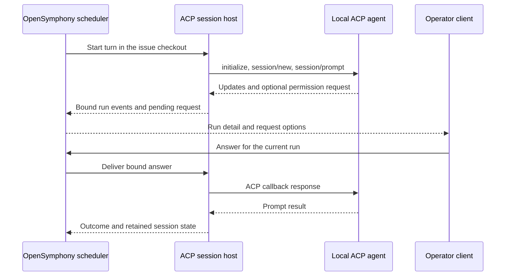

# ACP harness

ACP is a way to run an agent that speaks Agent Client Protocol v1 over a local
stdio process. OpenSymphony still owns issue scheduling, workspaces, retries,
and operator decisions. The agent process works inside the issue's checkout.
ACP is an execution choice: it can run a single-repository issue or a child in
a [multi-repository project](multi-repository.md).



## Configure a local agent

Install the agent's CLI and complete its own login first. Then add a named
profile to the selected central config. This excerpt assumes the rest of the
instance and tracker configuration already exists:

```yaml
routing:
  harness: acp
  harness_profile: cursor
acp:
  profiles:
    cursor:
      command: /absolute/path/to/agent
      args: [acp]
      transport: stdio
      protocol_versions: [1]
      permissions:
        mode: operator
```

`routing.harness_profile` chooses a profile ID; the ID is not a vendor switch
in the scheduler. Use an absolute executable path and literal arguments. If
the agent needs environment credentials, map target names to source variable
names under `env_refs`; do not put values in the file or arguments. Omit
`auth` when the CLI's existing login is sufficient. An explicit `auth.method_id`
must be advertised by the agent.

With `permissions.mode: operator`, a live TUI, web, or desktop client must be
available to answer permission requests. `deny` selects an offered one-time
rejection; `allow_once` selects an offered one-time approval for a trusted
unattended profile. Unsupported options are cancelled rather than guessed.
See [ACP profile configuration](configuration.md#acp-stdio-profiles) for session
model/mode/options, host services, MCP attachments, deadlines, and extension
registration.

Run `opensymphony run --config <path>` after selecting the profile. A profile
preflight checks the executable and configuration; the live session negotiates
authentication, persistence, modes, options, and optional methods. Inspect
`/api/v1/capabilities` and the active run detail before offering an operation
to an operator. A profile entry alone does not mean that an optional method is
available.

## Sessions, recovery, and vendor support

The session host retains an idle agent process for compatible later turns.
Recovery loads or resumes a known session only when the peer advertised the
method. If a prompt might have been submitted before a disconnect, the run is
fenced for reconciliation; OpenSymphony does not resend that prompt blindly.
Cancel acknowledgement follows a matching stopped prompt result. The
[operations guide](operations.md#acp-client-validation-and-limits) describes
limits and recovery diagnostics.

The [live qualification report](acp-live-qualification.md) records tracked
issue runs through pinned Cursor and Devin CLIs. Both advertised
`session/load`; neither advertised `session/resume` in that qualification.
Cursor's registered plan and todo methods are limited to its observed pinned
version. Generic ACP v1 profiles do not inherit those vendor methods.

ACP agents are local processes with trusted host access. Choose the executable,
credentials, and permission policy accordingly. The process runs with its
current directory set to the issue workspace.

<!-- BEGIN OPENSYMPHONY MANAGED MEMORY SYNC -->

## Current model

- COE-608 contributed: PR #241: feat(acp): add supervised ACP v1 client and launch profiles (merge `70619ec`)
- COE-609 contributed: PR #243: feat(acp): retain host-owned sessions with durable recovery (merge `5b67134`)
- COE-610 contributed: PR #242: feat(acp): implement host callbacks and session configuration (merge `cd683ea`)
- COE-611 contributed: PR #245: COE-611: Route production workers through ACP profiles (merge `80e5ac3`)
- COE-612 contributed: PR #246: Route ACP operator requests through scheduler and clients (merge `a6cd118`)
- COE-613 contributed: PR #247: COE-613: Add registered ACP extensions and harness operations (merge `90154b5`)

## Important invariants

- Preserve the behavior described in the recent captured changes unless current code and tests show it has changed.
- Use capsule source refs to inspect the original PR or Linear issue when context is ambiguous.

## Operational flow

- No generated diagram requested for this sync.

## Known gotchas

- No area-specific gotchas were inferred from the selected memory.

## Recent changes

- COE-608: ACP Profiles And Executable Protocol Client
- COE-609: ACP Session Ownership And Durable Recovery
- COE-610: ACP Client Callbacks And Session Configuration
- COE-611: ACP Execution Routing And Worker Integration
- COE-612: ACP Operator Requests And Response Routing
- COE-613: ACP Extensions And Harness Operations
- COE-615: ACP Runtime Conformance And Live Qualification

## Source refs

- COE-608
- COE-609
- COE-610
- COE-611
- COE-612
- COE-613
- COE-615

<!-- END OPENSYMPHONY MANAGED MEMORY SYNC -->
