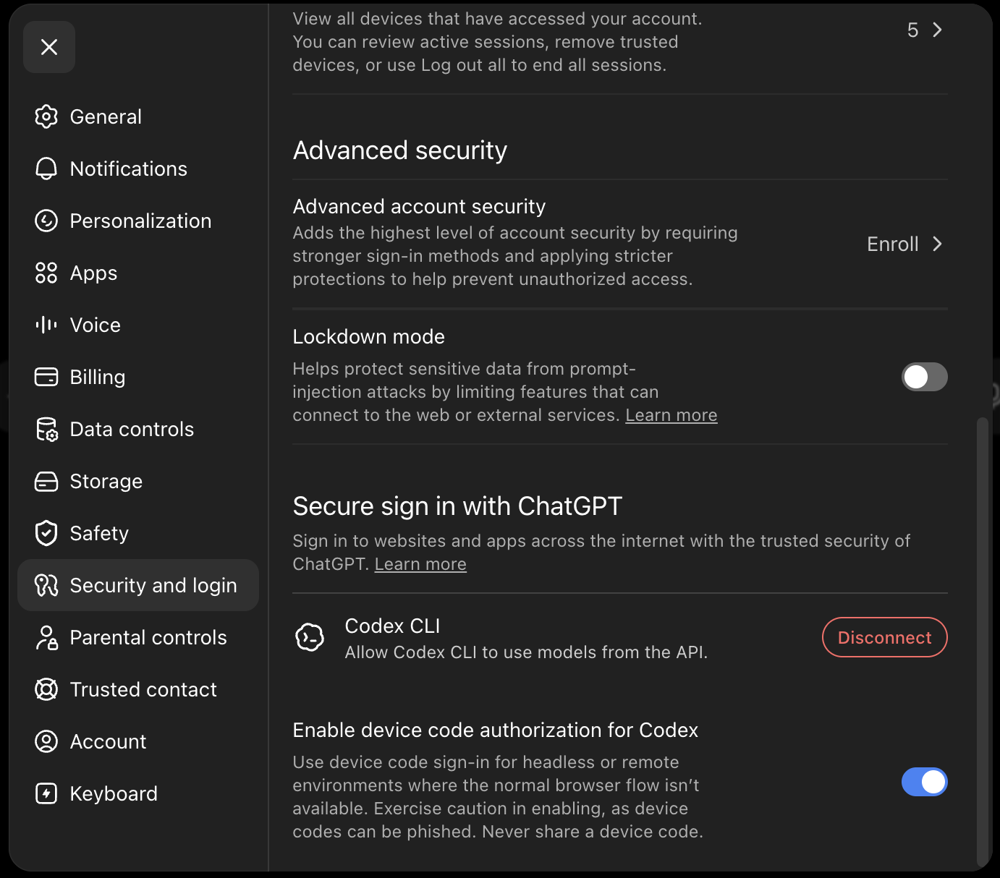

# Configuration

This document covers target-repo bootstrap, generated files, and the runtime
configuration that `opensymphony run` expects.

## Central configuration

`opensymphony run` selects configuration before it reads any repository
checkout. Selection order is:

1. `--config <path>`;
2. `~/.opensymphony/config.yaml`;
3. `./config.yaml` during the explicit legacy compatibility window.

Central files use `schema_version: 1` and own instance roots, routing mode,
tracker profiles, project sets, Linear projects, repository inventory,
credential references, review profiles, scheduler, integration, workspace, and
memory-catalog policy. Relative paths resolve from the central config file.
Remote values may contain no credentials, repository aliases are unique, and
strict unknown fields fail before tracker polling or workspace creation.
Any central-only key such as `instance`, `routing`, `tracker_profiles`, or
`repositories` selects the strict central parser, even when its discriminator
is malformed; those files fail closed instead of falling through to legacy
current-directory discovery. A legacy file containing only `schema_version`
remains on the legacy parser. `compatibility.allow_repo_local_config` is currently unsupported
and must remain `false`; setting it to `true` fails validation rather than
silently discarding repository-local orchestration settings.
The `openhands.front_matter` subsection carries the complete typed OpenHands
transport, local-server, conversation/LLM, subscription-reference, and
WebSocket profile when a workflow is migrated. `scheduler.retry.max_attempts`
is enforced as the maximum number of automatic retries; omitted values retain
the legacy retry behavior.
`workspace.retain_failed` applies only to failed or retry-exhausted outcomes:
successful, cancelled, and tracker-terminal releases still clean up their
workspaces.
Queued retries do not advance the durable retry count until dispatch begins, so
a restart during the backoff window cannot mistake a pending retry for an
exhausted one. Recovery restores persisted non-exhausted retry counts before
redispatch, while terminal tracker reconciliation removes stale exhaustion
markers. Once the limit is reached, the instance state root records a
retry-exhaustion marker before a disposable failed workspace is removed; the
marker keeps the issue parked across a later run.

The supported routing variants are explicit:

```yaml
routing:
  mode: legacy_single
  repository: github:repository:example
```

`legacy_single` keeps unlabelled existing tasks on one configured repository.
`project_set` validates the multi-repository model but remains disabled until
its later release gates pass; it fails before starting the scheduler rather
than silently falling back to the current directory. Operational recovery
commands (`debug` and `rehydrate`), plus all doctor modes, reject the same gated
mode before selecting an unrelated checkout for workflow or conversation-store
discovery.
`rehydrate` also accepts `--config <path>` when an instance is not the default
home configuration. `memory init` refuses to treat a selected central config
as a repository-local memory file; initialize the local memory config instead.

Every run records one `sha256:` config generation in startup diagnostics and
the initial control-plane event. Resolved credential values are never part of
the central model or its serialized diagnostics.

## Configuration migration

Migration is explicit and staged:

```bash
opensymphony migrate preflight --repo /path/to/repo
opensymphony migrate apply --repo /path/to/repo --config /path/to/repo/config.yaml
opensymphony migrate rollback --config /path/to/repo/config.yaml
```

`preflight` is read-only and reports recognized workflow fields, clone-hook
risks, and secret/remote-risk booleans without printing their values. `apply`
backs up the legacy config and workflow, writes central config and a reduced
workflow body through same-directory staging, preserves supported repository-local
`codex`/`logging` namespaces, and records an activation marker specific to the
central config destination. A marker is written after validation and staging but
before replacement so an interrupted apply remains recoverable. Relative legacy
workspace roots are resolved against the target repository, and migration
requires an exact `Target branch:` line.
Applying again with a separate `--output` detects the active destination
generation before creating a backup or rewriting the source. `rollback`
restores the backup and refuses to run while the instance's strict-run marker
is active; it restores the original file permissions as well as file contents.
Repeating a complete `apply` is a no-op; a partially published activation
promotes its staged workflow or restores the backup before retrying.
When preserving a legacy `.opensymphony/memory` tree, preflight refuses an
active memory writer without changing files. Apply, direct CLI memory writers,
automatic capture, archive, and the local memory server claim the same atomic
coordination lock; the server holds it for its lifetime while publishing an
activity marker. Owner PIDs allow stale lock and marker recovery after an
unclean exit; apply removes stale markers only after it owns the lock. Rollback
also fingerprints the migrated catalog and refuses to restore the legacy
generation after post-migration memory has changed, preserving that evidence.

## Bootstrap

Use `opensymphony init` from the target repository root:

```bash
cd /path/to/target-repo
opensymphony init
```

`opensymphony init` is the primary setup path for existing repositories. It:

- fetches the current starter files from the template repo's raw GitHub URLs
- copies missing files into the target repo
- leaves an existing `AGENTS.md` untouched and writes starter guidance to
  `AGENTS-example.md` during first-time setup
- prompts before overwriting other conflicting files
- fills the `WORKFLOW.md` clone hook from `git remote` when possible
- offers to fill the Linear project slug/key in `WORKFLOW.md`
- records the feature PR and sync target branch in `WORKFLOW.md` under
  `## Branch target`; the default is `develop`, and `--target-branch main` or
  `--target-branch release/next` can set another local branch name
- creates or updates `.gitignore` so local OpenSymphony runtime state stays untracked
- can optionally scaffold OpenHands AI PR review
- can configure the GitHub Actions variables, label, and optional review secret
  automatically when `gh` is installed and can access the repository
- prompts whether to commit and push the generated OpenSymphony files so shared
  skills and, when selected, AI PR Review setup are present in the remote
  repository before story work starts

For repositories that are already initialized, `opensymphony update` is the
maintenance path for template-owned skills:

```bash
cd /path/to/target-repo
opensymphony update
```

The command first checks whether the installed CLI is older than the newest
published `opensymphony` release and only runs `cargo install opensymphony --locked`
when it actually needs to. If the current directory already looks like an
OpenSymphony target repo because it has both `WORKFLOW.md` and `config.yaml`,
the command then refreshes changed or new files under `.agents/skills/`.
Upgrades from a CLI older than 2.11 must first satisfy the Rust 1.97.1 minimum;
the one-time `cargo +stable` recovery command is documented in
[Operations](operations.md).

When `--target-branch` or `--code-review` is present, `update` uses workflow
settings mode instead of the normal maintenance path. It requires `WORKFLOW.md`
and `config.yaml`, patches the managed workflow markers, rewrites known legacy
branch-control phrases when the target branch changes, and skips Cargo
self-update, template skill refresh, and memory bootstrap:

```bash
opensymphony update --target-branch develop
opensymphony update --target-branch main
opensymphony update --target-branch release/next
opensymphony update --target-branch release/next --code-review openhands
```

The target-branch marker is also the source of truth for persistent Code Graph
indexing. `POST /api/v1/code/repos/{repo_id}/index` and
`code_index_repo` resolve that branch server-side; they do not accept a client
path. If the marker is absent, the indexer uses `develop`. Ensure the selected
branch is available as `origin/<branch>` or a local branch before indexing.

The template repository is still the upstream source of those starter assets,
but it is an implementation detail of `opensymphony init`, not a required
manual setup step:

- [kumanday/OpenSymphony-template](https://github.com/kumanday/OpenSymphony-template)
- [Raw template base](https://raw.githubusercontent.com/kumanday/OpenSymphony-template/refs/heads/main/WORKFLOW.md)

Fresh init branch-target behavior is fully consistent only when that template
repo's `WORKFLOW.md` and `pull`/`push`/`land` skills have the same marker-aware
wording as this repository's local copies.

## Files Added By `init`

Core bootstrap payload:

- `WORKFLOW.md`
- `AGENTS.md`
- `AGENTS-example.md` when `AGENTS.md` already existed before first-time setup
- `config.yaml`
- `.gitignore` created or updated to ignore OpenSymphony runtime state
- `.agents/skills/` copied recursively, including skill-local `references/`, `scripts/`, and similar helper files
- `.agents/skills/linear/references/`
- `.github/CODEOWNERS`
- `.github/pull_request_template.md`

## Refreshing Template Skills

Without workflow-setting flags, `opensymphony update` only refreshes
template-managed files under `.agents/skills/`.

It does not:

- rerun the interactive `init` prompts
- modify `WORKFLOW.md`
- merge or rewrite `AGENTS.md`
- create `AGENTS-example.md` after `config.yaml` exists
- copy `.github/*` bootstrap files
- delete repo-local extra skills that are not in the template tree

Optional AI PR review scaffolding, controlled by the review provider choice
(`--review-provider <openhands|codex|none>` or the interactive prompt):

- `openhands`: `.github/workflows/ai-pr-review.yml` and
  `.agents/skills/custom-codereview-guide.md`
- `codex`: `.agents/skills/custom-codereview-guide.md` only — reviews run
  through the Codex GitHub integration with a ChatGPT subscription, so no
  Actions workflow, secret, or label is scaffolded. `init` prints the
  one-time browser setup checklist; see
  [codex-code-review-setup.md](codex-code-review-setup.md).

The chosen provider is recorded in `WORKFLOW.md` as
`Active review provider:` under `## Automated AI PR review`, which tells
agents how to re-trigger review after follow-up pushes (`review-this` label
for openhands, an exact `@codex review` comment for codex).

For initialized target repos, `opensymphony update --code-review openhands`
updates the marker and attempts to enable an existing
`.github/workflows/ai-pr-review.yml` through `gh workflow`. It does not create
or repair that workflow when the file is missing. Switching with
`--code-review codex` or `--code-review none` records the marker and attempts
to disable an existing OpenHands review workflow. If `gh` is unavailable,
unauthorized, or cannot access Actions, `update` warns and leaves the workflow
state unchanged; verify or adjust it manually.

## Labels

If you choose the `openhands` review provider and `gh` is available with
repository access, `opensymphony init` can create the `review-this` label for
you. If automation is skipped, create it once per repository:

```bash
gh label create "review-this" --description "Trigger AI PR review" --color "d73a4a" --force
```

The `codex` provider does not use the `review-this` label.

## Review The Generated Workflow

After `init`, review `WORKFLOW.md` and `config.yaml`.

If you accept the final commit/push prompt, `init` stages only the files it
created or updated, commits them as `chore: bootstrap OpenSymphony`, and pushes
`HEAD` to the detected git remote. If the repository already has staged changes
or no single remote can be detected, `init` leaves git alone and prints a
reminder to commit and push manually.

Important fields:

| Field | Description | Env Var | Example |
|-------|-------------|---------|---------|
| `tracker.project_id` | Linear `Project.id` used to resolve the provider project before issue polling | - | `2b7c...` |
| `tracker.project_slug` | Linear `Project.slugId` from the project URL | - | `my-project-5250e49b61f4` |
| `WORKFLOW.md` `Target branch:` | Local branch name agents use as `origin/<target-branch>` for syncs and PR bases | - | `develop`, `main`, `release/next` |
| `workspace.root` | Where to store per-issue workspaces | - | `~/.opensymphony/workspaces` |
| `routing.*_env` | Optional environment-variable selectors for harness, model, and model profile | `OPENSYMPHONY_*` | `MY_HARNESS` |
| `memory.token_env` | Name of the environment variable used by the memory service | `OPENSYMPHONY_MEMORY_TOKEN` | `MEMORY_TOKEN` |
| `openhands.conversation.agent.llm.model` | LLM model to use | `LLM_MODEL` | `openai/accounts/fireworks/models/glm-5p1` |
| `openhands.conversation.agent.llm.credential_mode` | LLM credential adapter | - | `api_key` or `openai_subscription` |

For Linear trackers, `tracker.project_slug` should store the project's
`slugId`, not a `team/project` path.

## Environment Variables

OpenSymphony uses standard OpenHands environment variable names.

Fireworks example via the OpenAI-compatible provider adapter:

```bash
export LLM_MODEL="openai/accounts/fireworks/models/glm-5p1"
export LLM_API_KEY="fw-..."
export LLM_BASE_URL="https://api.fireworks.ai/inference/v1"
```

The gateway also exposes the local model settings seam through
`GET /api/v1/model-settings`. The default API-compatible profile maps to the
same three environment variables:

- `LLM_MODEL` identifies the configured model string.
- `LLM_API_KEY` is exposed only as a credential reference.
- `LLM_BASE_URL` identifies the optional OpenAI-compatible base URL.

Subscription-backed model profiles are represented as credential references for
local keychain storage, isolated OpenHands auth-directory storage, and future
hosted broker storage. Those references are safe to render in clients because
they do not contain raw API keys, OAuth access tokens, or refresh tokens.

For the Codex app-server harness, OpenSymphony represents the local ChatGPT
subscription as a Codex CLI login reference:

- `profile.id`: `codex-chatgpt-local-keychain`
- `credential_reference.kind`: `codex_cli_login`
- `credential_reference.reference`: `codex-cli:chatgpt-login`
- `storage_mode`: `codex_cli_home`

This reference tells clients and operators that readiness is owned by the
installed Codex CLI. OpenSymphony checks readiness with `codex --version`,
`codex app-server --help`, and `codex login status`; it does not read private
Codex credential files and does not copy OAuth access or refresh material into
workspaces, workflow files, logs, Linear comments, or browser payloads. Gateway
checks are cached briefly in process to avoid spawning Codex subprocesses for
every client poll, and each Codex CLI check has a bounded timeout so a stalled
local login probe reports an unknown/non-ready state instead of blocking the
gateway request.

The `codex_local_readiness` field on `GET /api/v1/model-settings` reports:

- whether the Codex CLI command is installed and runnable,
- whether the app-server surface is available,
- whether `codex login status` reports `Logged in using ChatGPT`,
- explicit logged-out, expired, unsupported, permission-denied, or unknown
  states,
- safe operator commands for login (`codex login --device-auth`), status
  (`codex login status`), and logout (`codex logout`).

The current classifier treats `Logged in using ChatGPT` and
`Logged in with ChatGPT` from `codex login status` as ready. It renders
logged-out, expired, unsupported, permission-denied, and unknown outputs as
non-ready status states rather than guessing or reading private credential
files.

Default OpenAI model profiles use `gpt-5.5` for API-compatible and
subscription-backed entries. Existing saved desktop or web profiles remain
unchanged until an operator edits them.

Harness and model selection are configured with the alpha `routing`
front-matter section. When omitted, `opensymphony run` keeps the default
`openhands_agent_server` harness and the OpenHands LLM settings from the
workflow.

```yaml
routing:
  harness: codex_app_server
  model: gpt-5.5
  model_profile: codex-chatgpt-local-keychain
```

The same selected values can be supplied by a launcher or desktop shell through
environment variables:

- `OPENSYMPHONY_HARNESS`
- `OPENSYMPHONY_MODEL`
- `OPENSYMPHONY_MODEL_PROFILE`

When `routing.harness` is `openhands_agent_server`, a selected `routing.model`
or `OPENSYMPHONY_MODEL` becomes the OpenHands conversation LLM model. When
`routing.harness` is `codex_app_server`, a selected model is passed to Codex
`thread/start`, `thread/resume`, and `turn/start`; `thread/archive` is used
only to roll back a newly created thread if its first manifest cannot be
persisted. If no model is selected, OpenSymphony omits the model and lets the
Codex CLI/app-server use its own default from Codex configuration such as
`~/.codex/config.toml`. Codex-only routing does not resolve OpenHands LLM
environment variables or launch the managed OpenHands server.

Local Codex execution uses a full-automation profile. OpenSymphony launches the
installed Codex CLI as
`codex --dangerously-bypass-hook-trust app-server --stdio`, validates
`initialize`, `thread/start`, `thread/resume`, the rollback `thread/archive`,
and `turn/start` against the schema generated by that installed CLI, creates
the thread with `approvalPolicy: "never"` and `sandbox: "danger-full-access"`,
then starts the task turn with
`approvalPolicy: "never"` and `sandboxPolicy: { "type": "dangerFullAccess" }`.
If the installed Codex schema rejects those fields, update Codex before running
the Codex harness.

Set `opensymphony run --dry-run` to preview the selected harness/model without
launching a model-backed worker. The selected harness must still be available
and able to start runs.
For local Codex stdio execution, `OPENSYMPHONY_CODEX_BIN` may point to an
alternate Codex binary in trusted operator environments only; it is not a
hosted-mode tenant input.

OpenAI ChatGPT/Codex subscription credentials are available only when
OpenSymphony is built with the `openhands-subscription-credentials` Cargo
feature. The workflow stores environment-variable names and auth-directory
references, not token values. The short-lived access token should be established
through the documented OpenHands SDK login flow, such as browser login or
device-code login, and exposed to the orchestrator through the configured
environment reference:

```yaml
openhands:
  conversation:
    agent:
      llm:
        model: gpt-5.2-codex
        credential_mode: openai_subscription
        subscription:
          vendor: openai
          access_token_env: OPENHANDS_OPENAI_SUBSCRIPTION_ACCESS_TOKEN
          account_id_env: OPENHANDS_OPENAI_SUBSCRIPTION_ACCOUNT_ID
          auth_directory_env: OPENHANDS_AUTH_DIR
          auth_method: device_code
          open_browser: false
```

In subscription mode, OpenSymphony constructs the same OpenAI/Codex LLM request
shape documented by the pinned OpenHands SDK: `openai/<model>`,
`https://chatgpt.com/backend-api/codex`, official Codex headers,
`litellm_extra_body.store=false`, and streaming enabled. Refresh tokens remain
in the selected credential store and must not be copied into workspaces,
workflow files, logs, Linear comments, or browser payloads.

The `auth_directory_env`, `auth_method`, `open_browser`, and `force_login`
fields describe how the subscription credential was established by the SDK or a
future broker. They are retained in the launch profile for diagnostics and UI
status, but OpenSymphony does not forward them as undocumented agent-server
conversation fields. Only the short-lived access token reference is resolved
when building the OpenHands conversation request.

### Local Codex And Subscription Testing

The local Codex app-server stdio harness is compiled into normal OpenSymphony
builds. OpenHands ChatGPT/Codex subscription adapter tests remain
feature-gated. Use the smallest feature set for the path you are exercising:

```bash
cargo check-system-duckdb \
  --features openhands-subscription-credentials

cargo test-system-duckdb \
  --features openhands-subscription-credentials \
  subscription -- --nocapture

cargo test-system-duckdb --test codex_app_server
```

The old `codex-app-server-prototype` feature has been removed; local stdio
harness capability, lifecycle, normalization, and benchmark checks run through
normal OpenSymphony builds.

To install a local `opensymphony` binary with subscription credentials enabled
while using the system DuckDB development path:

```bash
export DUCKDB_LIB_DIR="/opt/homebrew/opt/duckdb/lib"
export DUCKDB_INCLUDE_DIR="/opt/homebrew/opt/duckdb/include"
export DYLD_LIBRARY_PATH="$DUCKDB_LIB_DIR${DYLD_LIBRARY_PATH:+:$DYLD_LIBRARY_PATH}"
cargo install --path . --no-default-features \
  --features duckdb-prebuilt,openhands-subscription-credentials
```

For a local subscription-auth smoke test, establish the OpenAI ChatGPT/Codex
subscription credential with the documented OpenHands SDK browser or device-code
login flow, then export only the short-lived token and optional account identity
that your workflow references:

```bash
export OPENHANDS_OPENAI_SUBSCRIPTION_ACCESS_TOKEN="<short-lived-access-token>"
export OPENHANDS_OPENAI_SUBSCRIPTION_ACCOUNT_ID="<optional-account-id>"
export OPENHANDS_AUTH_DIR="$HOME/.openhands/auth"
```

Then set `credential_mode: openai_subscription` in `WORKFLOW.md` as shown above
and run `opensymphony run` with the feature-enabled binary. Do not store OAuth
JSON files, refresh tokens, or access tokens in the repository, issue
workspaces, Linear comments, or browser-visible payloads.

For manual verification of the pinned OpenHands SDK OAuth behavior, run the SDK
login flow in the managed OpenHands virtual environment. Use a temporary `HOME`
when you want the probe to keep OAuth credentials out of your normal
`~/.openhands/auth` directory:

```bash
cat > /tmp/openhands_subscription_probe.py <<'PY'
import os
from openhands.sdk import LLM

llm = LLM.subscription_login(
    vendor="openai",
    model=os.environ.get("OH_SUBSCRIPTION_MODEL", "gpt-5.2-codex"),
    auth_method=os.environ.get("OH_AUTH_METHOD", "device_code"),
    open_browser=False,
    force_login=os.environ.get("OH_FORCE_LOGIN", "0") == "1",
)

headers = llm.extra_headers or {}

print("subscription:", getattr(llm, "_is_subscription", False))
print("model:", llm.model)
print("base_url:", llm.base_url)
print("stream:", llm.stream)
print("has_api_key:", bool(llm.api_key))
print("header_keys:", sorted(headers.keys()))
print("has_chatgpt_account_id:", "chatgpt-account-id" in headers)
print("litellm_extra_body:", llm.litellm_extra_body)
PY

cd ~/.opensymphony/openhands-server
export OH_SPIKE_HOME=/tmp/opensymphony-openhands-subscription-spike
rm -rf "$OH_SPIKE_HOME"
mkdir -p "$OH_SPIKE_HOME"

OPENHANDS_SUPPRESS_BANNER=1 \
HOME="$OH_SPIKE_HOME" \
OH_FORCE_LOGIN=1 \
OH_AUTH_METHOD=device_code \
uv run python /tmp/openhands_subscription_probe.py
```

The device-code flow may require enabling **Security and login -> Enable device
code authorization for Codex** in ChatGPT settings:



Successful output should show `subscription: True`, model
`openai/gpt-5.2-codex`, base URL `https://chatgpt.com/backend-api/codex`,
`has_api_key: True`, `has_chatgpt_account_id: True`, and
`litellm_extra_body: {'store': False}`. The cached OAuth file for this isolated
probe is written to:

```text
/tmp/opensymphony-openhands-subscription-spike/.openhands/auth/openai_oauth.json
```

This SDK credential cache is not the same thing as
`~/.opensymphony/openhands-server`. The latter is OpenSymphony's managed
OpenHands tool installation and conversation workspace. The SDK auth cache is
where OpenHands stores ChatGPT OAuth credentials by default. Current
OpenSymphony subscription support validates and forwards a subscription-shaped
LLM configuration, but it does not yet provide an operator-facing command that
logs in, refreshes, and injects those credentials automatically.

The workflow supports `${VAR}` syntax for environment variable substitution in
the front matter:

```yaml
openhands:
  conversation:
    agent:
      llm:
        model: ${LLM_MODEL}
```

## Conversation Condensation

Optional conversation condensation is enabled by default per workflow to reduce
long-history context pressure before the agent-server hits the model window:

```yaml
openhands:
  conversation:
    agent:
      condenser:
        max_size: 240
        keep_first: 2
```

OpenSymphony forwards an OpenHands `LLMSummarizingCondenser` that reuses the
conversation agent's LLM settings. The condenser is enabled by default with
`max_size: 240` and `keep_first: 2`. To disable it, set `enabled: false`.

## Runtime Config

`opensymphony init` also copies a starter `config.yaml` next to the target
repository `WORKFLOW.md`.

Minimal local-supervised example:

```yaml
control_plane:
  bind: 127.0.0.1:2468

openhands:
  tool_dir: ~/.opensymphony/openhands-server

memory:
  auto_capture: true
  auto_archive: false
```

The bind address is the single local HTTP surface for both the gateway API used
by the web/desktop clients (`/api/v1/capabilities`,
`/api/v1/dashboard/snapshot`, and related `/api/v1/*` routes) and the
control-plane compatibility routes used by the TUI (`/healthz`,
`/api/v1/snapshot`, and `/api/v1/control/events`).

Provision that app-managed directory with:

```bash
opensymphony install openhands
```

For managed local OpenHands, OpenSymphony derives a repository-scoped
conversation store from `openhands.tool_dir` and the target repo path:

```text
<tool_dir>/workspace/conversations/repos/<repo-key>/
  active/
  archived/
```

`opensymphony run` first moves known terminal issue conversations from existing
workspace manifests into `archived/`, then prepares `active/` from current
Linear candidate issue manifests before launching the managed server with
`OH_CONVERSATIONS_PATH` pointing at `active/`. The terminal-workspace sweep is a
temporary compatibility shim for older flat stores. This keeps completed or
manually archived issue history out of normal server startup while preserving it
for `opensymphony debug`.

When your workflow points at an external OpenHands agent-server with
`openhands.transport.session_api_key_env`, `config.yaml` can omit
`openhands.tool_dir`.

Use [examples/target-repo/config.yaml](../examples/target-repo/config.yaml) as
the starting template if you want to inspect the checked-in example.

[examples/configs/local-dev.yaml](../examples/configs/local-dev.yaml) is a
developer-facing doctor fixture for this repository. It is not the runtime
config that `opensymphony run` looks for in a target repo.

## Planning Workspace

The planning workspace is a dense, editable, review-oriented UI for the
hosted-client mode. It renders from the local planning workspace state and is
intended to feel like a task-creation tool with Linear as the publishing
target.

### Intentional MVP limitations

- The fixture planning session is intentionally reused across project switches
  in the local app shell. The workspace is not yet keyed per project, so
  switching projects keeps the same conversation, artifacts, and hierarchy
  until the gateway provides real planning sessions or a per-project session
  loader is implemented. This is documented behavior, not a bug.

## Memory Configuration

Project memory stores runtime state under `.opensymphony/memory` and can be
captured automatically by `opensymphony run`. Runtime automation is controlled
by `config.yaml`:

```yaml
memory:
  auto_capture: true
  auto_archive: false
```

`auto_capture` defaults to `true`. It captures terminal issue transitions
observed by the run loop. `auto_archive` defaults to `false`; when enabled, it
archives only after successful capture with no blocking warnings.
When archive succeeds and the repo uses the managed local OpenHands server,
OpenSymphony also moves the issue's persisted conversation from the repo-scoped
`active/` store to `archived/`.

Initialize the shared memory policy and learned ontology file with:

```bash
opensymphony memory init
```

This creates `.opensymphony/memory/memory.yaml` and updates `.gitignore` so only
that shared config is tracked. Capsules, markdown indexes, DuckDB, source
snapshots, and runtime logs remain local:

```text
.opensymphony/memory/
  memory.yaml
  issues/
  indexes/
  memory.duckdb
```

`memory.yaml` contains policy plus learned structure. `memory init` seeds stable
areas from existing top-level `docs/*.md` files when present; otherwise it
starts with an empty `areas` map and capture evolves it from Linear and PR
narrative evidence:

```yaml
memory_root: .opensymphony/memory
visibility: private
index_path: .opensymphony/memory/memory.duckdb
confidence_threshold: 75
markdown_indexes: true
code_intel:
  enabled: true
  ast:
    enabled: true
    max_file_bytes: 2097152
    max_files_per_request: 200
    max_matches_per_request: 2000
    max_capture_bytes: 4096
docs:
  public_root: docs
  default_visibility: public
  deny_private_links: true
areas:
  openhands-runtime:
    title: OpenHands Runtime
    docs_target: docs/openhands-runtime.md
    visibility: public
    status: stable
    confidence: 85
    aliases:
      - OpenHands Runtime
    source_refs:
      docs:
        - docs/openhands-runtime.md
      linear_labels:
        - runtime
```

`code_intel.ast.max_file_bytes`, `max_files_per_request`,
`max_matches_per_request`, and `max_capture_bytes` bound AST reads, query
results, and rendered snippets. Generated, vendor, build, and cache directories
(`.git`, `node_modules`, `target`, `dist`, `build`, `.venv`, `__pycache__`,
`coverage`, `.next`, `.turbo`, `vendor`, and `generated`) are skipped with
trace warnings during directory traversal; explicitly requested files inside
them can still be parsed when they pass path containment and resource limits.

Private memory should stay out of source control. Commit
`.opensymphony/memory/memory.yaml` and generated public docs when appropriate;
do not commit issue capsules, markdown indexes, DuckDB, source snapshots, or
runtime state.

## OpenHands PR Review

If you opt into OpenHands PR review during `init`, the CLI will try to
configure the GitHub Actions variables, label, and optional review secret for
you when:

- `gh` is installed
- `gh` can access the target repository
- you approve the automation prompt

If any of those are missing, `init` falls back to a short checklist plus the
manual `gh` commands. The full verification and branch-protection guidance
lives in the OpenSymphony docs at
[ai-pr-review-human-setup.md](ai-pr-review-human-setup.md); `init` does not
copy that guide into the target repository.

<!-- BEGIN OPENSYMPHONY MANAGED MEMORY SYNC -->

## Current model

- COE-546 contributed: PR #217: Code Graph bootstrap indexing UX and E2E validation (merge `5cc1e83`)

## Important invariants

- Preserve the behavior described in the recent captured changes unless current code and tests show it has changed.
- Use capsule source refs to inspect the original PR or Linear issue when context is ambiguous.

## Operational flow

- No generated diagram requested for this sync.

## Known gotchas

- No area-specific gotchas were inferred from the selected memory.

## Recent changes

- COE-546: Code Graph Bootstrap UX And End-To-End Validation

## Source refs

- COE-546

<!-- END OPENSYMPHONY MANAGED MEMORY SYNC -->
