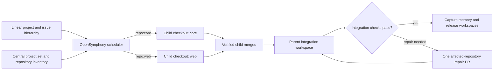

# Multi-repository projects

OpenSymphony can run one Linear project across several source repositories. A
terminal issue names one repository with a `repo:<alias>` label. A parent issue
has no repository label: it waits for its children to merge, then checks their
combined result in a separate integration workspace.

The single-repository setup still works. Multi-repository routing is an explicit
choice in the central configuration, and each project set lists the projects
and repositories it may use. [Configuration](configuration.md) defines the
complete file format and [migration](migration-3.0.0.md) covers existing
installations.

For example, a project with a `core` repository and a `web` repository can
have a core child labeled `repo:core`, a web child labeled `repo:web`, and an
unlabeled parent that checks their merged work together. The aliases come
from the central repository inventory.

## Set up a project set

1. Give the instance its own state and workspace roots in the central config.
   Select `routing.mode: project_set`, an `active_project_set`, and a tracker
   profile.
2. Add each Linear project under `linear_projects` with its provider project
   ID and allowed repository aliases. Add each repository once under
   `repositories`, with its canonical provider ID, remote, target branch,
   checkout credential reference, review profile, and contained instruction
   path. The [configuration model](specs/multi-repo-orchestration-spec.md#8-configuration-model)
   shows how these sections fit together. Keep credential values in environment
   variables referenced by `credentials`.
3. Label every terminal implementation issue with exactly one managed
   `repo:<alias>` label. Use an alias allowed by its Linear project. Leave
   parent issues unlabeled. A missing, duplicate, unknown, or out-of-scope
   binding is shown as a routing blocker; OpenSymphony does not choose a
   repository from the current directory.
4. Put repository-specific instructions in each checkout's configured file,
   such as `AGENTS.md`. Put instructions for checking the combined result in
   the project set's `integration_instructions` file. The parent sees each
   repository's instructions in a separate section.

Start the configured instance with `opensymphony run --config <path>`. The
selected config's hash appears in startup diagnostics and its first
control-plane event.

For an existing single-repository installation, run `opensymphony migrate
preflight --repo <path>` before `migrate apply`. Review the generated central
config and keep `legacy_single` until the repository inventory, labels, and
project set are ready. Migration does not enable `project_set` by itself.

## What happens during a run

OpenSymphony resolves an issue's repository binding before it creates a
workspace. A child runs in a verified checkout of its bound repository. The
scheduler records the selected config and repository inventory generations so
recovery cannot silently move an in-flight issue to another repository. A
binding change stops the old worker and prepares a new generation.

When all children have provider-confirmed merges, the parent uses retained
child generations to prepare contained worktrees. It runs the configured
integration checks, can open a repair PR in one affected repository, and then
refreshes and verifies the combined result. Terminal cleanup waits for memory
capture and releases worktrees and leases from the leaves upward. The
[workspace lifecycle](workspace-and-lifecycle.md) explains the ownership and
recovery rules in detail.

## Roll out safely

Strict multi-repository routing remains an explicit operator choice. Before
enabling it for a project set, run the [hermetic release gate and disposable
live rollout](multi-repository-rollout.md) at one clean commit and record the
selected config hash. The live gate exercises child PRs, a failed check and
same-PR repair, parent verification and repair, and complete teardown in a
non-production project set. Production activation requires a separate
operator decision.

The desktop and web task graphs show the repository binding and parent
blockers. Run detail shows the selected repository, checkout generation,
integration state, and repair evidence. The gateway exposes the same facts
without credential-bearing remote URLs.
