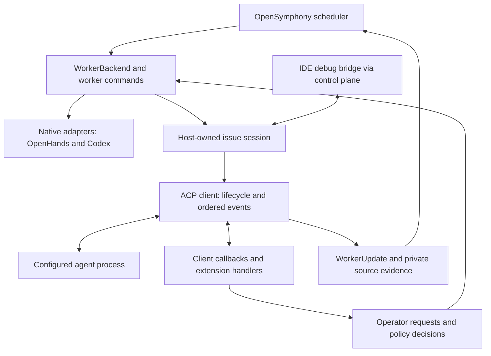

# ACP harness adapter design

Status: proposed implementation design. Research date: 2026-09-22.
Repository baseline: `50d8bb777d828515ffacdcd2c2ce9bbc9d3dba52`.
This document specifies behavior to implement; it does not claim an operational ACP adapter.

## Decision

Add one generic **ACP client adapter**, exposed as harness kind `acp`, with named
agent profiles. Keep OpenHands agent-server and Codex app-server as native
adapters. ACP is an additional execution boundary; OpenSymphony retains its own
orchestration, workspace, policy, and event models.

A new agent that implements the supported ACP version and transport should need
only a launch profile. A custom extension requires either a declarative operation
description or a small Rust handler when its behavior must be interpreted. Adding
an agent must not require a new scheduler harness enum variant.

M12.99 ships stable ACP v1 over local stdio. ACP v2 and network transports are
follow-on work requiring a concrete endpoint and verified lifecycle contract. The interoperability promise is **any conforming
agent within the supported version, transport, authentication, and capability
matrix**. ACP compliance alone does not establish restart recovery, unattended
operation, remote workspace access, or support for arbitrary vendor features.



## Repository fit

The current [HarnessAdapter trait](https://github.com/kumanday/OpenSymphony/blob/50d8bb777d828515ffacdcd2c2ce9bbc9d3dba52/crates/opensymphony-domain/src/harness.rs)
provides capability discovery. Execution runs through
[WorkerBackend, HarnessRouteDecision, and WorkerUpdate](https://github.com/kumanday/OpenSymphony/blob/50d8bb777d828515ffacdcd2c2ce9bbc9d3dba52/crates/opensymphony-orchestrator/src/scheduler.rs)
and the [CLI worker backend](https://github.com/kumanday/OpenSymphony/blob/50d8bb777d828515ffacdcd2c2ce9bbc9d3dba52/crates/opensymphony-cli/src/orchestrator_run/backends.rs).
Implement both the discovery and execution paths.

The backend contains two-harness assumptions: Codex-specific dispatch followed
by the OpenHands path, a Boolean Codex/non-Codex session-switch comparison,
recovery eligibility, and separate interrupt handling. Replace these with
explicit matching on harness identity at those boundaries. Compare ACP profile
identity as well as harness kind before reusing a session. Merely adding `acp`
to discovery would leave lifecycle and recovery behavior incorrect.

Add `crates/opensymphony-acp/src/` as an internal source module included from
`src/lib.rs`, consistent with the single published crate. Keep protocol types,
session lifecycle, callback implementation, and vendor handlers there. Put only
execution wiring in the CLI backend. Reuse workspace preparation, hook execution,
instruction provenance, runtime envelopes, memory grants, and worker reporting.
The ACP path must not start a managed OpenHands server or instantiate an
OpenHands execution client as a prerequisite.

Use the official Rust `agent-client-protocol` SDK for protocol types, RPC
correlation, and dispatch. The inspected SDK source reports version `2.2.0`;
its package version is separate from the negotiated ACP wire version. Pin the
validated dependency and schema versions during implementation. Use OpenSymphony
process ownership with an SDK stream transport if the SDK launcher cannot meet
cwd, environment scrubbing, shutdown, or capture requirements. Verify Tokio
integration and frame limits in the first implementation slice. Do not copy the
Codex JSON-RPC client or add a TypeScript bridge.
Sources: [SDK source at inspected commit](https://github.com/agentclientprotocol/rust-sdk/blob/28688b2d97a81975ff875180c3a3e46e6cad0161/src/agent-client-protocol/Cargo.toml),
[SDK design](https://agentclientprotocol.github.io/rust-sdk/design.html).

The [M13 IDE attachment specification](opensymphony-acp-debugging-spec.md) defines
OpenSymphony as an ACP server for an editor. Both protocol roles share the same
host-owned runtime session through control-plane commands and events. Their RPC
identities and negotiation are independent; their execution ownership is shared.

## Configuration and identity

Proposed workflow syntax, not accepted by the current parser:

```yaml
routing:
  harness: acp
  harness_profile: cursor-local

acp:
  profiles:
    cursor-local:
      command: agent
      args: [acp]
      transport: stdio
      protocol_versions: [1]
      env_refs:
        CURSOR_API_KEY: CURSOR_API_KEY
      auth:
        method_id: cursor_login
      permissions:
        mode: operator
      extensions: [cursor]
```

`command` plus `args` is an argv vector, never a shell template. Both process cwd
and session cwd come from the scheduler-bound, verified issue workspace. Profiles
cannot override that directory. Environment entries reference operator-owned
variables; secrets never become literal workflow values, command-line arguments,
manifests, or diagnostic output. Apply the existing checkout-credential exclusions
and scoped memory environment before launch.

Add a typed ACP configuration section and `routing.harness_profile` through both
workflow and central configuration resolution. Validate profile references,
supported transports and versions, and handler names before dispatch. Optional
capabilities may degrade; explicitly required capabilities fail before prompting.
For ACP, resolve `routing.model` through the agent's advertised model/config
options. Reject unsupported explicit overrides instead of silently using the
default. Existing model profiles need an explicit ACP mapping; OpenHands model
and credential semantics must not be forwarded blindly.

Persist this identity with the existing run and conversation envelope:

- Harness kind `acp`, profile ID, and non-secret profile fingerprint.
- Actual agent name/version when reported, executable/package identity when known,
  ACP version, and SDK/schema versions.
- Opaque session ID, issue/repository/workspace binding, run/attempt identity, and
  connection generation.
- Effective capability snapshot, enabled extension contract versions, and actual
  configured model/options.
- Prompt submission state, completion/cancellation evidence, and recovery status.

Profile IDs are stable identifiers; display names are labels. An agent name is
self-reported metadata, not authentication. Session IDs remain opaque and must
not be interpolated directly into filenames. A profile edit, route change,
workspace change, or credential-scope change must pass compatibility validation
before reuse. Recovery uses persisted identity instead of silently picking the
current default profile.

## Protocol and session lifecycle

The first supported stack is ACP v1 semantics, JSON-RPC 2.0 envelopes, UTF-8 JSON
with LF framing, over stdio. The ACP transport page still describes Streamable
HTTP as a draft; an SDK's HTTP/WebSocket implementation does not itself establish
universal network interoperability.
[ACP transports](https://agentclientprotocol.com/protocol/v1/transports).

Use one host-owned supervised process and connection per issue session, with
one outstanding prompt. Workers borrow the session across turns and attempts;
the end of a worker attempt does not itself end the session. Keep eligible idle
sessions under explicit bounded retention policy so an IDE can attach to the
same live context even when the harness lacks persistence. Active work and
attachment/control leases pin the session; limits refuse new launches or
visibly retire eligible idle sessions instead of evicting active ones.

Expose the owner through existing control-plane commands and ordered events for
separate debug processes. Enforce a single owner and generation fencing; never
launch a second agent to attach to a live session. M12.99 implements the owner,
identity, retention and command/event seam. M13 implements scheduler holds and
exclusive IDE writer transfer. Cleanup closes/reaps the process only after
owned work is stopped and all relevant leases are released. Host/process loss
requires capability-gated restoration; transcript inspection is separate from
restoring agent context. A cross-issue process pool is outside this scope.

1. Prepare the workspace and run `before_run` through existing host logic.
2. Launch the configured process with bounded stdout frames, bounded stderr
   capture, and supervised child-process cleanup.
3. Register incoming request, notification, and closure handlers before sending
   `initialize`. Negotiate only implemented versions; missing optional
   capabilities mean unsupported. Complete the configured authentication method
   if needed. Advertise terminal/browser authentication only when implemented;
   unattended runs report an actionable authentication failure otherwise.
4. Create a session, or restore a compatible persisted one. Wait for setup and
   configuration to finish before sending a prompt. For a fresh session, send the
   full workflow prompt; for a restored one, send continuation guidance.
5. Drive prompt, callbacks, events, interruption, and outcome reporting concurrently
   through the adapter actor. The orchestrator alone decides scheduling changes.

Initialization exchanges versions and capabilities; it is not the OpenHands
WebSocket readiness barrier.
[ACP initialization](https://agentclientprotocol.com/protocol/v1/initialization).

### Completion and cancellation

For v1, the response to `session/prompt` carries the turn's stop reason.
`session/cancel` is a notification. Confirm cancellation from the original prompt
response with `cancelled`, after processing preceding updates. Answer pending
permission requests with their cancellation outcome and keep reading until the
terminal response or deadline. Sending the notification is not acknowledgement.
[ACP prompt and cancellation contract](https://agentclientprotocol.com/protocol/v1/prompt-turn).

OpenSymphony outcome policy:

| Observation | Adapter result |
| --- | --- |
| `end_turn` | Successful turn; scheduler/tracker policy determines issue completion or continuation. |
| `max_tokens` or `max_turn_requests` | Resource-limited turn; retain reason and use bounded continuation policy. |
| `refusal` | Explicit unsuccessful outcome; no silent retry loop. |
| `cancelled` | Cancellation acknowledged; preserve the requesting interrupt reason. |
| RPC error, EOF, crash, or deadline | Distinct failure/uncertain state, including whether submission may have occurred. |
| Unknown stop reason | Preserve it and surface an unsupported outcome; never infer success. |

On an interrupt deadline, record timeout before escalating to owned process-tree
termination. Reaping a local process is separate evidence from a protocol-level
cancel acknowledgement. A process that delegates remote work may leave that work
alive; a profile needs a tested stop/reconciliation contract before OpenSymphony
can treat its local exit as proof of remote quiescence. Preserve the workspace
and identity when stop cannot be established.

Keep optional `$/cancel_request` handling separate from stopping an agent turn.
Use it for supported individual RPC operations; a request cancellation error
does not prove all session execution stopped.
[ACP request cancellation](https://agentclientprotocol.com/protocol/v1/cancellation).

### Persistence and recovery

ACP v1 `session/load` is optional and replays conversation history. The currently
documented `session/resume` is separately capability-gated and restores without
history replay; list and close are also optional capabilities. Use advertised
support rather than assuming every method exists because it appears in the docs.
[ACP session setup](https://agentclientprotocol.com/protocol/v1/session-setup).

Track restoration events as a separate replay segment. Do not count their tools,
tokens, or messages as fresh work. Local sequence numbers provide arrival order;
they are not an agent cursor. History reconstruction does not prove the outcome
of an interrupted prompt or provide exactly-once prompt execution.

Before sending a prompt, durably record an attempt/submission marker. If a crash
occurs after possible delivery and before a terminal outcome, do not resend it
automatically. Mark the outcome uncertain, stop/reconcile where supported, and
retain the existing run's cleanup fence. Permit a new attempt only after the
scheduler has resolved the prior execution risk. Standard ACP alone supplies no
universal idempotency key or remote-running-state query.

When a known-finished session cannot be restored, start a fresh session with the
full workflow context and record the reset reason. An explicit profile requirement
for persistence instead produces a clear incompatibility. Never call unsupported
resume/load methods or represent a reset as continuity.

### ACP v2

ACP v2 implementation is outside M12.99. A future implementation must remain
behind explicit configuration and a feature flag while the protocol is draft. Its prompt response acknowledges acceptance; session state updates carry
foreground progress and completion information. Its resume and update semantics
also differ, and its client filesystem/terminal execution APIs are removed.
When adding v2, use separate lifecycle handling selected once per connection;
do not scatter version checks through scheduler code.
[ACP v2 migration](https://agentclientprotocol.com/protocol/v2/migration).

Do not interpret the next v2 `idle` as completion of a particular prompt without
a supporting guarantee. A v2 profile must establish exclusive session control
and a tested foreground-state boundary before supporting unattended issue runs.
Keep acceptance, requires-action, foreground completion, and background activity
distinct. Ordered delivery alone does not establish prompt attribution.
[SDK application ordering](https://agentclientprotocol.github.io/rust-sdk/ordered-application-dispatch.html).

## Client callbacks and operator responses

Implement the standard v1 client surface as part of broad interoperability:

| Surface | OpenSymphony responsibility |
| --- | --- |
| `session/request_permission` | Preserve all offered option IDs/kinds; apply configured policy or route an operator decision. |
| `fs/read_text_file`, `fs/write_text_file` | Session-bound, contained file access with protocol-correct text/line behavior and resource limits. |
| `terminal/create`, `output`, `wait_for_exit`, `kill`, `release` | Own terminal processes, output limits, exit status, cancellation, and teardown for that session. |
| Session configuration and legacy modes | Validate advertised IDs/values, apply before prompting, consume subsequent config updates. |
| Elicitation, when advertised | Represent structured information requests separately from approval decisions and validate responses. |
| MCP attachments | Supply existing scoped memory/tool servers using transports the agent supports. |

Filesystem and terminal capabilities are optional on the wire. Advertise them
only when enabled and fully implemented. A narrow first smoke test may disable
them; broad agent qualification must exercise them.
[ACP filesystem](https://agentclientprotocol.com/protocol/v1/file-system),
[ACP terminals](https://agentclientprotocol.com/protocol/v1/terminals),
[ACP configuration](https://agentclientprotocol.com/protocol/v1/session-config-options).

Use the verified workspace root for filesystem containment, including symlink
and nonexistent write-target handling. Terminal cwd defaults to that workspace;
reject unauthorized alternate roots. Bind terminal IDs and file requests to the
owning connection/session. Process supervision and callback containment are not
a sandbox for a trusted local agent that also has direct host access.

The operator path is worker request event → orchestrator-owned pending request →
snapshot/gateway → validated operator command → worker response channel.
Permissions and plans appear in `ApprovalRequest`; structured questions appear
in the run inputs endpoint. The gateway returns an `ActionReceipt` only after
the live worker acknowledges delivery to the original RPC responder.

Define explicit profile policies: `operator`, `deny`, and `allow_once` for an
operator-authorized unattended environment. Default to `operator`; headless
operation without a responder fails clearly or uses an explicitly chosen policy.
Select an option actually offered by the agent, by its semantic kind, and return
its opaque ID. Do not fabricate `allow-once` IDs or silently grant lasting access.
[ACP permission options](https://agentclientprotocol.com/protocol/v1/tool-calls).

Every pending interaction needs a deadline and cancellation path. Bind decisions
to run, session, connection generation, and request ID; reject stale or duplicate
decisions. Expire them on disconnect and never replay an old approval after
restart. Waiting for input is a visible worker state with a response deadline,
so stall detection and concurrency accounting remain deliberate. Other issues
continue to schedule normally.

Advertise form elicitation only with reviewable inputs and decline/cancel controls;
forms cannot collect credentials. Advertise URL elicitation only with an
out-of-band flow that shows the destination and obtains user consent before
opening it. Opening a URL does not establish completion of the external action.
[ACP elicitation](https://agentclientprotocol.com/protocol/v1/elicitation).

## Custom ACP extensions

Support both directions: OpenSymphony invoking an agent operation, and an agent
requesting a client operation. Use three mechanisms with distinct obligations:

| Mechanism | Behavior |
| --- | --- |
| `_meta` on supported objects | Preserve namespaced data; forward only configured fields at their documented locations. |
| Custom notification | Retain a bounded private payload; optionally project known content into existing UI/domain events. |
| Custom request | Validate, dispatch to an explicit handler, and return exactly one result/error with the original RPC ID. |

Standard custom method names start with `_`; advertise negotiated extensions in
capability `_meta`. Unknown requests receive `-32601`; unknown notifications get
no RPC response. Unknown metadata must not become executable instructions.
[ACP extensibility](https://agentclientprotocol.com/protocol/v1/extensibility).

Implement a small registry inside `opensymphony-acp`, using the SDK's existing
typed handlers and raw dispatch hooks. Each registered extension declares its
namespace, supported contract versions, direction, capability predicate,
method names, parameter/result validation, timeout, and effect/permission policy.
Enable it only for the selected profile and supported peer contract. Peer
advertisement means support, not authorization. If an agent does not advertise a
vendor capability, require an explicit version-tested profile rather than
guessing from its name.

Use declarative descriptors for bounded JSON request/response operations that
need no domain interpretation. Add Rust handlers for callbacks, stateful flows,
or meaningful projection into approvals, questions, plans, artifacts, and
telemetry. No dynamic library loader, embedded scripting language, or general
plugin runtime is needed.

Expose enabled outbound operations through one proposed typed operator action,
`HarnessOperation { run_id, operation_id, arguments }`, using existing action
authorization and receipts. Resolve `operation_id` in the enabled registry;
callers cannot supply an arbitrary wire method or session ID. The handler owns
target binding and request validation. Return a structured result or an artifact
reference. A timeout on a state-changing operation means outcome unknown, not
permission to repeat it; only documented idempotent operations may be retried.
Lifecycle-changing extensions still report through scheduler-owned commands.

### Concrete vendor handling

Cursor is the first qualified extension. Its documentation lists
`cursor/ask_question` and `cursor/create_plan` as blocking methods and describes
todo, task, and generated-image methods as notifications. The authenticated
pinned CLI instead emitted ID-bearing `cursor/create_plan` and
`cursor/update_todos` requests without `params.sessionId`. The exact-version
registration enables those observed methods and binds them to the runtime-owned
session; question, task, image, and no-ID notification paths remain unqualified.
Classify each actual frame by the presence of an RPC ID, including `0`, because
request and notification behavior must follow the wire envelope.
[Cursor ACP](https://cursor.com/docs/cli/acp).

Map the qualified plan request to plan approval and the qualified todo request
to bounded todo activity. A received subagent notification is evidence about
work, not authority to start an OpenSymphony issue.
Generic unknown-request handling must never hang the agent or auto-approve it.

Devin CLI should be another profile of the same `acp` adapter. Keep its identity
and lifecycle separate from a Devin cloud API adapter. Qualify actual CLI versions
and extension frames before documenting operation names or capabilities. Secret
management, deployments, archival, and browser attachment need individual
contracts and policy; an extension passthrough cannot establish their semantics.

For Exo, a future ACP facade can reuse its native execution model and expose
selected extensions. OpenSymphony consumes the published facade contract;
Exo-specific implementation hooks and EBO instrumentation remain separate work.

## Events, capabilities, and evidence

Use one ordered application queue for notifications, response markers, and
closure. Process prior updates before publishing a completed turn. Callback
handlers enqueue work and return promptly; permission waits and terminal waits
must not block RPC dispatch. Set explicit frame, queue, outstanding-request,
terminal-output, and artifact limits. On saturation, terminate with a visible
diagnostic rather than silently losing control or evidence messages. Ensure
cancellation can still be serviced under output load.

Preserve a private, redacted source envelope before typed normalization, including
unknown variants. Record direction, observed timestamp, connection generation,
arrival sequence, session/run binding, and replay/live origin. Native timestamps
or identifiers are separate optional fields; do not invent them. Redaction and
retention apply to stderr and extension data as well as standard frames.

Project recognized text, thought, tool, plan, usage, and artifact updates through
existing worker/control-plane surfaces. Unknown data remains inspectable without
affecting scheduling. Tool updates are partial updates to an existing tool ID;
missing values must not erase prior state. Keep cumulative session usage,
current-context occupancy, and per-turn token usage distinct. Do not populate
input/output counters from a context-size estimate or count replay twice.

Keep the existing static `HarnessCapability` for adapter-level support. Add
profile availability and per-run negotiated capabilities so clients can
distinguish compiled support, a configured runnable profile, and an active
session's effective features. Compute effective support from the intersection of
adapter implementation, peer advertisement, and local policy. Availability
before launch should mean configured/preflight-ready, not authenticated proof.

Add optional protocol provenance fields without changing the meaning of existing
`transport` fields: semantic protocol/version, RPC envelope, encoding, framing,
and carrier. Extension capabilities identify enabled operations and their schema
versions. Keep executable paths, environment values, auth metadata, and private
payloads out of public discovery. Update Rust/TypeScript DTOs and round-trip
tests together.

Do not map `session/resume` directly to the existing pause/resume buttons: session
restoration and pausing live execution are different capabilities. Similarly,
history loading is not cursor replay, and captured ACP frames are not full native
harness evidence. EBO can ingest them with explicit source/fidelity metadata;
this adapter cannot recover native behavior absent from the ACP stream.

## Implementation sequence and acceptance

M12.99 delivers an operational runtime adapter, including production routing and
operator responses. M13 builds multi-harness IDE attachment on that foundation.
The authoritative task graph and Linear mappings are in
[the ACP runtime and IDE package](../tasks/acp-runtime-ide-task-package.yaml).

| Task | Deliverable and acceptance gate |
| --- | --- |
| OSYM-900 | Typed profiles and executable SDK-backed v1 client; prompt, callbacks, ordered updates, cancel and teardown. |
| OSYM-901 | Host-owned live sessions, durable identity, retention, control/event seam and capability-gated recovery. |
| OSYM-902 | Actual opensymphony run routing, workers, hooks, memory, manifests, interrupts and public capabilities. |
| OSYM-903 | Filesystem/terminal callbacks, model/config selection and scoped MCP setup. |
| OSYM-904 | Worker-to-operator-to-worker permissions/input round trip, gateway/UI controls and deadlines. |
| OSYM-905 | Bidirectional extensions, registered outbound operator actions and verified vendor handling. |
| OSYM-906 | Adversarial conformance, two independent live harnesses and implemented-contract documentation. |

M13 adds shared attachment, exclusive control handoff, the ACP IDE bridge, editor
setup, desktop launch and qualification before switching the default debug UX.
The bridge consumes the ordered ACP source stream, while normalized worker events
remain the scheduler/dashboard projection. Host-owned filesystem, terminals,
environment and memory grants remain stable when an editor attaches.

Required checks for the implementation:

- Fake peer interleaves notifications, responses, permission requests, and cancel;
  includes string/zero IDs, malformed/oversized frames, unexpected EOF, unknown
  methods/variants, output floods, and an unresponsive child. No deadlocks or
  false completion/cancel acknowledgements.
- Two issue workers cannot cross-route session IDs, terminal handles, approvals,
  or extension results. Callback path tests cover traversal, symlink escape,
  nonexistent write targets, and limits.
- Recovery covers new/load/resume, unsupported persistence, history replay,
  profile changes, credential/grant changes, and crashes before/after possible
  prompt submission. No automatic ambiguous prompt replay or early cleanup.
- Extension tests cover incoming/outgoing requests, notifications, `_meta`,
  supported/unsupported versions, denied operations, unknown methods, stale
  responses, malformed results, and timeout without unsafe automatic retry.
- Capability discovery includes schema round trips, gateway endpoint behavior,
  adapter-boundary tests, and Rust/TypeScript parity.
- Live runs with pinned agent versions prove a workspace edit, permission round
  trip, cancellation, restart behavior, and at least one vendor extension. Use
  Cursor plus a structurally different agent such as DeepSeek Harness or Devin;
  record versions, actual capabilities, source frames, outcomes, and limitations.
  Fake-peer tests alone do not qualify a real harness.

DeepSeek's published ACP package is a useful recovery contrast: it supports
persistent sessions while explicitly excluding transcript replay and several
other optional surfaces.
[Pinned DeepSeek ACP contract](https://github.com/deepseek-ai/deepseek-harness/blob/ddefc45fbc7f8e46dd73185e68295696d1297887/packages/acp/acp/README.md).

Implementation updates belong in the workflow resolver and central config,
gateway capability/approval/action DTOs, scheduler worker messages, CLI execution
backend, workspace/session persistence, and the new ACP module. Keep shared
manifest changes additive and compatible with existing OpenHands/Codex state.
Do not require a general harness-framework rewrite before the first working run.

Update `docs/harness-adapter-compatibility.md`, `docs/configuration.md`,
`docs/architecture.md`, `docs/operations.md`, `docs/workspace-and-lifecycle.md`,
`docs/testing-and-operations.md`, and `docs/sources.md` with the implemented
contract and validation evidence. Milestone sequencing is recorded in
`docs/implementation-plan.md`.

Protocol reference baseline:
[ACP schema/documentation commit](https://github.com/agentclientprotocol/agent-client-protocol/tree/b9d6aca6757d0f5b6e435cad54f9f04657aa9802).
Orchestration authority:
[upstream Symphony specification](https://github.com/openai/symphony/blob/be10a1b79df723d6d7612b5651c8522704dafb2e/SPEC.md).
