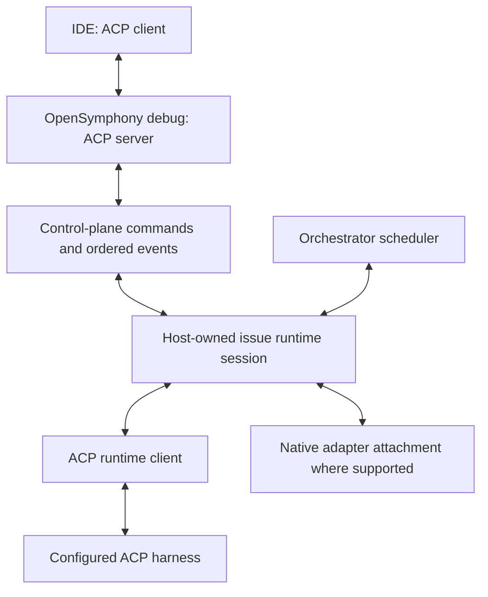

# OpenSymphony multi-harness ACP debugging and IDE attachment

Status: implementation specification for M13. Date: 2026-09-22.
Foundation: [M12.99 ACP runtime adapter](acp-harness-adapter.md).
This document specifies behavior to implement; it does not claim these paths are operational.

## Purpose and acceptance boundary

Attach an ACP-capable IDE to the same agent session OpenSymphony uses for an
issue. Every configured harness profile supported by the ACP runtime adapter is
a first-class attachment target. Adding a compliant profile within the supported
version, transport and capability matrix requires no provider-specific debug code.

Zed is the initial qualified editor. OpenSymphony owns workspace resolution,
runtime identity, execution facilities, control arbitration and scheduling. The
IDE provides code inspection, manual editing, diffs and an agent interaction UI.
OpenHands native debug and Codex resume/unarchive/app routes retain their existing
contracts. Their IDE capabilities are advertised individually; ACP profile support
is a core M13 requirement.

## Runtime and protocol ownership

M12.99 implements the ACP client, executable routing and host-owned session.
M13 implements the IDE-facing server, attachment resolution and exclusive writer
handoff. The two ACP legs have separate request IDs, session IDs, negotiated
versions and capability sets. They share one underlying runtime session.

The host owns each issue's supervised agent process and connection across worker
attempts and IDE attachments. The debug stdio process reaches that owner through
the existing control-plane command/event boundary. It never starts a competing
agent to attach to a live session. Reuse existing channels and persistence;
there is no separate scheduling service or debug session database.

A host retention policy keeps eligible idle sessions alive within bounded resource
limits. Attachments and active work pin a session against normal eviction. This
allows live attachment even when a harness has no persistent-session support.
After owner/process loss, restoration depends on negotiated load/resume support.
A recorded transcript is inspectable evidence, not restored agent context.

The normal attached-host path requires the owning host to be reachable. An
unavailable owner is an actionable state. Native offline recovery remains subject
to its existing identity validation; generic offline ACP ownership takeover is
outside this milestone.

## Verified workspace and session binding

`session/new.params.cwd` selects the exact issue workspace. The shared resolver
validates `.opensymphony/issue.json`, `.opensymphony/conversation.json`, the runtime
envelope, configured repository/checkout, run/generation and persisted
harness/profile identity. File existence alone is insufficient.

Reject parent workspace roots, nested directories, ordinary target-repository
roots, runtime conversation-store directories, symlink escapes, stale generations
and mismatched envelopes. Do not search upward or guess a session across
workspaces. Return the expected exact workspace and an actionable recovery step.

The attachment stores an opaque native session ID and a host session reference.
An OpenHands UUID is an adapter detail. The outer ACP session ID identifies this
IDE attachment, and is distinct from native identity and the writer lease.
Profile edits cannot redirect an existing session to the current default agent.

Native compatibility includes:

- OpenHands active, archived and legacy flat conversation-store lookup through
  `OpenHandsConversationStorePaths`, existing readiness/reconciliation and
  rehydration behavior, and SDK agent-server REST/WebSocket contracts.
- Codex manifest-bound thread identity, archived-thread unarchive, terminal
  `codex resume`, and explicit `--app` deep links. Preserve these routes without
  requiring a native Codex-to-ACP bridge in this milestone.

Use existing manifests and memory grants. No `.opensymphony/debug.json`,
per-issue IDE configuration or duplicate durable conversation record is needed.

## Scheduler and IDE control

Observation does not grant permission to prompt. A single orchestrator-owned
writer lease covers prompts, configuration mutations, lifecycle operations and
response ownership for a bound runtime session.

1. Attach and subscribe to status/events using the verified identity.
2. Request control through the orchestrator. Hold new issue dispatch and retries
   before waiting for the running turn to settle or cancelling it explicitly.
3. Resolve or transfer pending interactions under a defined single-responder
   policy. Grant the IDE a generation-fenced writer only after quiescence is
   established. A snapshot saying idle is insufficient without the scheduler hold.
4. Accept IDE prompts and allowed operations only while that lease is current.
   Route approvals/questions through the same validation and response machinery
   used by operator clients. Reject duplicate and stale decisions.
5. Release control after debug-owned work settles and pending requests are
   resolved. The orchestrator decides whether and when normal scheduling resumes.

Expose observing, acquiring, controlling, waiting-for-input, releasing and
uncertain states through existing control-plane DTOs. The UI cannot mutate
scheduler internals. Other issues continue scheduling normally.

Concurrent editor processes cannot acquire simultaneous writers. A lost editor,
expired lease, failed cancellation or host restart cannot authorize new execution
while the old execution may still be active. Use existing runtime-generation and
cleanup fences; deadlines produce explicit outcomes, not assumed success.
Manual workspace edits remain part of the trusted local workflow; the writer
lease arbitrates agent execution, not an OS filesystem lock on the editor.

## ACP bridge behavior

Use the official Rust SDK server role and the same pinned schema baseline as the
runtime adapter. Initial support is ACP v1 over stdio, with one active attachment
per bridge process. Human diagnostics use stderr; stdout contains protocol frames.

| Method/surface | Required behavior |
| --- | --- |
| `initialize` | Advertise a conservative implemented capability set before cwd identifies a profile; negotiate independently from the downstream harness. |
| `session/new` | Verify exact cwd and runtime binding, attach to the existing owner, return an attachment ID and accurate session options/status. |
| `session/prompt` | Acquire/validate control, translate supported content to the bound session, stream ordered source updates, and finish from that prompt's actual terminal result. |
| `session/cancel` | Cancel attachment-owned work through the runtime owner; remain responsive while callbacks or output are pending. |
| `session/close`, when advertised | Cancel ongoing work belonging to this attachment, settle pending requests, and free its subscriptions/control resources. Preserve durable workspace and native session identity. |
| Permission/input requests | Map request/session IDs across legs and deliver one validated decision to the original callback; use the declared host-operator fallback when the IDE cannot respond. |
| Config/modes and extensions | Allow only negotiated and policy-enabled operations through the owner; publish accurate per-session choices and results. |

Optional outer `session/list`, `session/load` and `session/resume` are unadvertised
until implemented. Restoring an underlying harness session is a separate concern
from offering editor history APIs. Unsupported features return explicit errors.

`session/close` is not a blanket detach-only operation: the ACP contract requires
cancelling ongoing session work before freeing resources. Apply that obligation
to attachment-owned work. Do not cancel unrelated scheduler work observed by a
read-only attachment or delete native conversations/workspaces.
On EOF/editor death, run the documented cancellation/release policy; retain an
uncertain fence if stopping cannot be proven. Never treat EOF as acknowledgement.
[ACP session setup](https://agentclientprotocol.com/protocol/v1/session-setup),
[ACP prompt and cancellation](https://agentclientprotocol.com/protocol/v1/prompt-turn).

## Fidelity, capabilities and extensions

For ACP-backed sessions, forward typed/source ACP events and permitted metadata
from the runtime owner's ordered queue. Keep domain normalization as a parallel
projection for scheduling and dashboards. Reconstructing IDE traffic from
`WorkerUpdate` summaries would discard tool/config/extension semantics.
Native adapters map their available events at their own boundary and report
unsupported fidelity explicitly.

Separate outer/inner RPC correlation and rewrite only identity fields whose
contract requires it. Preserve content blocks, partial tool updates, plans,
config changes and allowed `_meta`. IDs can be strings or numbers, including
zero. Tag replay segments and avoid duplicating historical tools or usage.
Bound queues/frames and report overflow; control/cancel processing must remain
responsive during output floods.

Effective IDE support is the intersection of bridge implementation, bound
harness capabilities, editor capabilities and local policy. Late attachment
cannot add client callbacks to an already initialized harness connection.
Connection-level initialize capabilities therefore use a conservative common
set; session-specific options and diagnostics describe the selected profile.

Filesystem access, terminals, environment, scoped memory and MCP execution stay
host-owned. An IDE's `mcpServers` or callbacks cannot silently change an existing
session's environment or tool set. Explicit supported reconfiguration requires
validation, control ownership and truthful capability/state updates.

Use the M12.99 extension registry for both legs. Forward registered operations
only when the peer contract and policy permit them; preserve approved metadata
without interpreting it as instructions. Blocking extension requests need a
real response route. A missing editor handler uses an explicitly supported
host-operator fallback or a clear error, never a silent stall or auto-approval.
Unknown requests return method-not-found; unknown notifications receive no reply
and remain bounded redacted evidence.

Cursor-specific non-underscore names belong in its version-tested registry
entry. New vendors use configured ACP profiles; no vendor switch belongs in
IDE attachment code. Capabilities advertised by a peer do not authorize effects.

## Commands and editor setup

- `opensymphony debug --acp-stdio`: noninteractive bridge, no issue argument;
  the editor supplies cwd through `session/new`.
- `opensymphony debug <issue-key> --cli`: explicit terminal/native debug path,
  using shared binding and control arbitration where applicable.
- `opensymphony debug <issue-key> --app`: preserve the supported native app path.
- `opensymphony debug <issue-key>`: capability-appropriate IDE launch or actionable
  fallback, enabled only after the multi-harness qualification task passes.

One static Zed external-agent entry launches `opensymphony` with argv
`["debug", "--acp-stdio"]`. Verify current Zed settings syntax during setup
implementation. The operator opens the exact issue workspace and starts the
OpenSymphony Debug external agent. No per-profile or per-issue editor entries
are required. Other ACP editors can use the same command within the supported
capability contract; actual qualification remains editor-specific.

The desktop debug action consumes the shared resolver/capabilities, displays
harness/profile and control readiness, and launches `zed -n <workspace-path>`
using an argv vector. It reports missing editor/workspace/owner, unsupported
restoration and busy control with recovery guidance. The operator starts the
agent thread in Zed unless a documented editor API provides that action.
Tauri owns presentation and launch; it does not contain runtime clients.

## Validation and rollout

Hermetic tests use a fake outer IDE plus fake inner ACP harness through the
actual runtime host and CLI bridge. They cover two profiles with differing
capabilities, opaque IDs, bidirectional callbacks, extensions, event fidelity,
cancel/close, replay and failures. They do not require Zed in CI.

The failure matrix includes invalid cwd/binding, missing owner/manifests,
nonpersistent context loss, unsupported restoration/extensions, stale/duplicate
responses, overlapping scheduler prompts, approval during handoff, editor crash,
lease expiry, output saturation, uncertain stop, and cleanup during attachment.
Native regressions cover all OpenHands store forms and Codex unarchive/resume/app.

Live acceptance requires two independent ACP harness implementations with pinned
versions, both attached through actual Zed to the sessions used by
`opensymphony run`. Demonstrate debug prompts, an operator/callback round trip,
cancellation, release and scheduler continuation. Include a verified vendor
extension or its documented IDE fallback. Record versions, negotiated features,
redacted evidence and limits separately from fake-peer results.

| Task | Deliverable |
| --- | --- |
| OSYM-840 | Multi-harness attachment core on M12.99 execution/session wiring. |
| OSYM-907 | Orchestrator-owned control transfer, response ownership and fences. |
| OSYM-841 | ACP IDE server/bridge with source fidelity and extension handling. |
| OSYM-842 | Static editor setup and capability-aware operator guidance. |
| OSYM-843 | Desktop launch using shared binding and capability results. |
| OSYM-845 | Multi-harness integration/race tests and real editor qualification, gated on M12.99 qualification. |
| OSYM-844 | Default IDE UX and preserved explicit CLI/native routes, after qualification. |

The executable dependency graph is in
[the ACP runtime and IDE task package](../tasks/acp-runtime-ide-task-package.yaml).
Update `docs/architecture.md`, `docs/configuration.md`, `docs/operations.md`,
`docs/workspace-and-lifecycle.md`, `docs/testing-and-operations.md`,
`docs/harness-adapter-compatibility.md` and pinned sources with implemented
behavior and evidence in the corresponding implementation changes.

## Repository grounding

- `crates/opensymphony-cli/src/debug_session.rs`: current workspace validation,
  native OpenHands attachment and Codex debug routing.
- `crates/opensymphony-openhands/src/conversation_store.rs`: store lookup and
  active/archive/legacy compatibility.
- `crates/opensymphony-workspace/src/models.rs`: workspace manifests/envelopes.
- `crates/opensymphony-orchestrator/src/scheduler.rs`: worker events, runtime
  identity, interrupts, scheduling and cleanup authority.
- `crates/opensymphony-control/`, gateway/schema and shared API clients:
  cross-process commands, snapshots, action receipts and event subscriptions.
- [ACP runtime adapter design](acp-harness-adapter.md): pinned protocol/SDK
  sources, lifecycle, callback, extension and operator response contracts.
